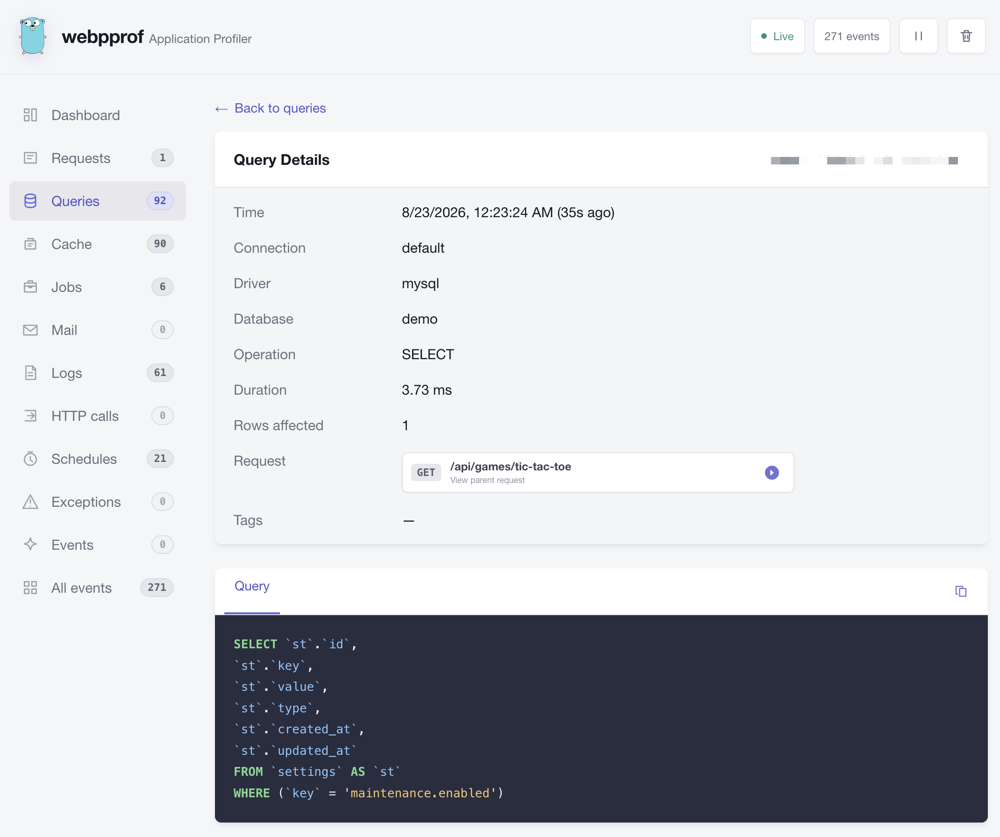
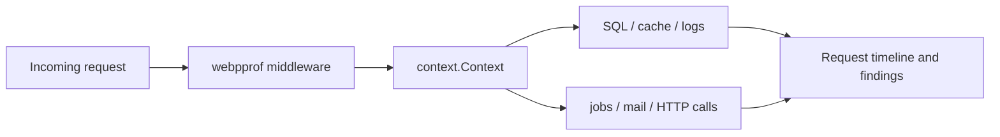

# webpprof — a Telescope-like request profiler and debug toolbar for Go

[](https://pkg.go.dev/github.com/levskiy0/webpprof)
[](https://github.com/levskiy0/webpprof/actions/workflows/ci.yml)

`webpprof` is a Telescope-like request profiler and debug toolbar for Go
(Golang) web applications. It shows everything one HTTP request did — SQL
queries, cache operations, background jobs, logs, mail, outgoing HTTP calls,
middleware, and panics — in one searchable local UI.

Use it to find why an endpoint is slow, inspect the SQL it executed, follow
related operations through `context.Context`, and replay a captured HTTP request
as cURL. webpprof runs inside the application and needs no external collector,
Docker stack, or database.

> webpprof is a development and diagnostic tool, not a long-term production
> APM. Captures are bounded and kept in memory by default, with optional local
> persistence for short investigations.



## Why webpprof?

Go already has excellent runtime profiling and observability tools. webpprof
adds a request-centric view for application debugging:

- Why is this HTTP endpoint slow?
- Which SQL queries, cache operations, and outgoing calls did it execute?
- Which logs, jobs, mail, and exceptions belong to it?
- What happened before a panic or failed response?
- Can an AI coding agent inspect the same captured timeline?

It complements `pprof`, tracing, and production APMs with a quick local Go
request profiler, SQL query profiler, debug toolbar, and observability dashboard.

## Features

- Inspect method, route, status, duration, headers, bounded bodies, raw HTTP,
  and ready-to-run cURL for captured requests.
- Correlate middleware, SQL, cache, jobs, logs, mail, outgoing HTTP, schedules,
  exceptions, and custom events through `context.Context`.
- Find possible N+1 queries, SQL-heavy requests, sequential HTTP calls, cache
  miss/query bursts, slow middleware, and direct operation failures.
- Explore a request-wide waterfall with nesting, critical path, bottleneck, and
  operation-time breakdown.
- Search and filter live events by entity, duration, status, time, and tags.
- Profile `net/http`, Gin, Chi, Echo, Fiber, gRPC, pgx, GORM, Bun,
  `database/sql`, Redis, queues, messaging, logging, mail, and OpenTelemetry.
- Let Codex, Claude, Cursor, and other MCP clients inspect the profiler through
  the separate read-only `webpprof-mcp` binary.

## Getting started

Install the core module:

```sh
go get github.com/levskiy0/webpprof@latest
```

Start a private profiler server and wrap the application handler:

```go
profiler, err := webpprof.Start(
    "127.0.0.1:6061",
    webpprof.WithToken(os.Getenv("WEBPPROF_TOKEN")),
    webpprof.WithExcludedRequests("GET /health", "GET *.js", "GET *.webp"),
)
if err != nil {
    return err
}
defer profiler.Shutdown(context.Background())

handler := webpprofhttp.MiddlewareWith(profiler, applicationHandler)
```

Pass the handler's context to database, cache, logger, queue, mail, and HTTP
client operations. Their profilers use that context to attach events to the
request:

```go
if err := repository.Find(r.Context(), playerID); err != nil {
    return err
}
logger.InfoContext(r.Context(), "player loaded", "player_id", playerID)
```

Open `http://127.0.0.1:6061/debug/webpprof/` and enter the token. Use
`webpprof.New(router, options...)` instead when the application owns the HTTP
server that serves the profiler UI.

Third-party integrations are independent nested Go modules, so installing Gin,
pgx, or GORM support does not add unrelated SDKs to the application's module
graph:

```sh
go get github.com/levskiy0/webpprof/profiler/gin@latest
go get github.com/levskiy0/webpprof/profiler/pgx@latest
go get github.com/levskiy0/webpprof/profiler/gorm@latest
```

See [all integrations and setup examples](docs/integrations.md).

## Debug with AI agents over MCP

`webpprof-mcp` is a separate process. It reads a running profiler through its
private HTTP API and exposes bounded, read-only MCP tools over stdio:

```text
Codex / Claude / Cursor <-- MCP over stdio --> webpprof-mcp <-- HTTP --> Go application
```

Installing the Go library does not install the MCP executable. Install its
independent module from any directory:

```sh
go install github.com/levskiy0/webpprof/cmd/webpprof-mcp@latest
webpprof-mcp --version
```

For a reproducible install, replace `@latest` with `@v0.3.1`.
The executable is written to `GOBIN`, or `GOPATH/bin` when `GOBIN` is unset.

Register it in Codex:

```sh
codex mcp add webpprof \
  --env WEBPPROF_TOKEN="$WEBPPROF_TOKEN" \
  -- webpprof-mcp --url http://127.0.0.1:6061/debug/webpprof/
```

The server provides tools to check status, list and wait for requests, inspect
automatic findings, and search related events. Payloads, values, arguments, and
stacks are omitted unless explicitly requested; tools never replay requests,
clear events, or mutate the application.

See [MCP installation, client configuration, tools, and security](docs/mcp.md).

## Try it locally

Run the bundled application from the repository root:

```sh
go run ./example
```

Open [http://127.0.0.1:3030/](http://127.0.0.1:3030/), generate a successful,
failed, or panic request, then inspect it at
[http://127.0.0.1:3030/debug/webpprof/](http://127.0.0.1:3030/debug/webpprof/).
The example is a real `net/http` application using `database/sql`, pure-Go
SQLite, structured `log/slog`, SQL EXPLAIN, and SQLite-backed profiler storage.
Its composition root shows the complete integration in one place: wrap the
HTTP handler, SQL driver, and slog handler once. Its ordinary handlers also use
the optional `Measure` helper to create service-level spans while SQL and logs
remain automatic. The clearly marked `/api/manual/*` routes contain the custom
integration and synthetic diagnostics. See [example/README.md](example/README.md)
for the annotated wiring, automatic behavior, routes, and configuration.

## What is recorded

| Entity | Automatic profilers | Examples of recorded data |
| --- | --- | --- |
| HTTP request | `http`, Gin, Chi, Echo, Fiber, gRPC | Route, status, headers, bounded bodies, duration, error |
| Middleware | `http`, Gin | Name, state, inclusive duration, error |
| SQL query | Bun, GORM, pgx, `database/sql`, OTel | SQL, connection, rows, duration, callsite, optional EXPLAIN |
| Cache | go-cache, go-redis | Store, operation, key, hit, TTL, duration, error |
| Job | go-queue, Asynq | Queue, state, attempts, bounded arguments, duration, error |
| Log | `slog`, Zap, zerolog | Level, message, structured fields, stack |
| Mail | email, go-mail | Transport, recipients, subject, state, duration, error |
| Outgoing call | HTTP, gRPC | Method, target, status, bounded payloads, duration, error |
| Messaging | NATS, kafka-go | Subject/topic, producer/consumer state, size, duration, error |
| Schedule | schedule | Name, planned time, state, duration, error or panic |
| Exception/event | HTTP recovery or manual API | Type, message, stack, custom fields and tags |

All entity types also have context-aware manual logging APIs. See the complete
[event and entity reference](docs/event-reference.md).

For application services and unsupported dependencies, measure a block without
writing stopwatch/error boilerplate:

```go
measurement := profiler.Measure(ctx, webpprof.Event{
    Kind: "service",
    Name: "players.refresh",
}, func(ctx context.Context) error {
    return players.Refresh(ctx) // nested profilers inherit this Event as parent
})

metrics.Record(measurement.Failed(), measurement.Duration)
return measurement.Err
```

`MeasureValueWith` covers `(T, error)` functions. `StartEvent` plus
`FinishResult` provides a manual lifecycle for async wrappers or result-derived
status and fields. All helpers use only the standard library, honor
`WithoutRecording`, preserve panics after recording them, and are documented in
[writing a custom profiler](docs/custom-profilers.md).

## Supported integrations

Core and standard-library profilers ship in the root module:

| Package | Integration point |
| --- | --- |
| `profiler/http` | Incoming `http.Handler`, named middleware, and `http.RoundTripper` |
| `profiler/sql` | `driver.Connector` or `driver.Driver` before `sql.OpenDB` |
| `profiler/slog` | Standard `slog.Handler` |
| `profiler/email` | Dependency-neutral mail `Sender` |
| `profiler/schedule` | Scheduled `func(context.Context)` callbacks |

Optional integrations are isolated modules:

| Area | Modules |
| --- | --- |
| HTTP and RPC | Gin, Chi, Echo, Fiber, gRPC |
| SQL and ORM | pgx, GORM, Bun |
| Cache | go-cache, go-redis |
| Jobs | go-queue, Asynq |
| Messaging | NATS, kafka-go |
| Logging | Zap, zerolog |
| Mail and tracing | go-mail, OpenTelemetry |

The application retains ownership of wrapped dependencies and closes them as
usual. Use one profiler per operation path: stacking Bun, GORM, pgx,
`database/sql`, or OTel instrumentation around the same query records
duplicates.

See [installation and recipes for every profiler](docs/integrations.md) and
[SQL callsites, EXPLAIN, and replay](docs/sql-profiling.md).

## Request correlation and findings

The request middleware stores a capture in `context.Context`. Context-aware
profilers and `Log*Context` functions inherit the request ID, tags, and current
parent operation:



Automatic findings currently cover repeated query fingerprints, SQL wall-clock
coverage, sequential safe HTTP calls, cache miss/query bursts, slow middleware,
slow operations, and failed jobs, mail, or HTTP calls.

See [request correlation, tags, middleware timing, and finding rules](docs/correlation.md).

## Configuration and security

Captures default to at most 10,000 events or 64 MiB for 30 minutes, with a
64 KiB limit per HTTP body. Configure retention, byte limits, sampling,
selective capture, redaction, disabled event kinds, and optional local storage
at startup:

```go
profiler := webpprof.New(
    mux,
    webpprof.WithRetention(2*time.Hour),
    webpprof.WithMaxEvents(25_000),
    webpprof.WithMaxBytes(128<<20),
    webpprof.WithRequestSampleRate(0.25),
    webpprof.WithSQLiteStorage("./var/webpprof/events.db"),
)
```

Keep the profiler on loopback or a private administrative network and always
set a strong token outside source control. Captures can contain personal data,
SQL, request bodies, mail, and stack traces even after automatic redaction.

- [Capture, retention, sampling, storage, and selective capture](docs/configuration.md)
- [Custom dashboard widgets and metrics](docs/dashboard.md)
- [Deployment and data security](docs/security.md)

## Documentation

| Guide | Use it for |
| --- | --- |
| [MCP server](docs/mcp.md) | Installing `webpprof-mcp` and connecting AI coding agents |
| [Integrations](docs/integrations.md) | Framework, SQL, cache, queue, messaging, logging, and mail setup |
| [Configuration](docs/configuration.md) | Capture limits, filters, sampling, storage, import, and export |
| [Dashboard](docs/dashboard.md) | Built-in and custom metrics, counters, and charts |
| [Correlation and findings](docs/correlation.md) | Context propagation, tags, middleware, and automatic analysis |
| [Event reference](docs/event-reference.md) | Manual APIs, `Meta`, entity fields, and background work |
| [SQL profiling](docs/sql-profiling.md) | Callsites, source links, EXPLAIN, and Go replay |
| [Custom profilers](docs/custom-profilers.md) | Implementing an adapter for another dependency |

## Development

The repository uses `go.work` for local development; consumers do not need it.
Each optional integration and the MCP command has its own `go.mod`.

```sh
make check
```

The check runs dependency isolation, module verification, `go vet`, all Go
tests, JavaScript syntax validation, and whitespace checks.

## License

webpprof is available under the [MIT License](LICENSE).
