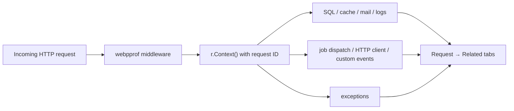

# webpprof — a Telescope-like request profiler and debug toolbar for Go

[](https://pkg.go.dev/github.com/levskiy0/webpprof)
[](https://github.com/levskiy0/webpprof/actions/workflows/ci.yml)

[https://github.com/levskiy0/webpprof](https://github.com/levskiy0/webpprof)

`webpprof` is a Telescope-like request profiler and debug toolbar for Go
(Golang) web applications. It shows everything one HTTP request did — SQL
queries, cache operations, background jobs, logs, mail, outgoing HTTP calls,
middleware, and panics — in one searchable local UI.

Open a request to see its complete application timeline, find the operation
that made an endpoint slow, inspect the SQL it executed, and replay the captured
HTTP request as cURL. Live WebSocket updates keep the dashboard current while
you reproduce a problem.

webpprof runs inside the application and needs no external collector, Docker
stack, or database. Captures are bounded and kept in memory by default, with
optional local persistence for short investigations. It is a development and
diagnostic tool, not a long-term production APM.


## Why webpprof?

Go already has excellent runtime profiling and observability tools. The missing
piece during application development is often a quick answer to questions about
one concrete request:

- Why is this HTTP endpoint slow?
- Which SQL queries, cache operations, and outgoing calls did it execute?
- Which logs, jobs, and exceptions belong to it?
- What happened before a panic or failed response?
- Can I inspect and replay the exact captured request without searching logs?

webpprof correlates those events through `context.Context` and presents them as
one request-centric view. This makes it useful as a Go request profiler, SQL
query profiler, Gin profiler, and local observability dashboard without turning
local debugging into an infrastructure project.

## Features

- **Request inspection:** method, route, status, duration, headers, bounded
  request and response bodies, raw HTTP, and ready-to-run cURL.
- **SQL query profiling:** SQL text, Go callsite, optional plain EXPLAIN, Go
  replay skeleton, connection, driver, database, rows, duration, and errors
  from Bun, `database/sql`, or OpenTelemetry spans.
- **Request correlation:** related middleware, queries, cache operations, jobs,
  logs, mail, outgoing HTTP calls, schedules, exceptions, and custom events.
- **Configurable Go callsites:** capture source stacks only for selected query,
  cache, mail, job, outgoing HTTP, and schedule operations.
- **Waterfall timeline:** inspect proportional Gantt bars on one request-wide
  scale, automatic `ParentID` nesting, the calculated critical path,
  bottleneck, and operation-time breakdown.
- **Live debug dashboard:** WebSocket updates, full-text search, entity filters,
  duration filters, tag watching, runtime health, queue health, and slowest
  operations.
- **Framework-friendly integration:** standard `net/http`, Gin, Bun, go-redis,
  `slog`, Zap, OpenTelemetry, and other focused profiler packages.
- **Zero work when disabled:** do not initialize the profiler in environments
  where it should not record; package-level logging helpers remain safe no-ops.


## Install

```sh
go get github.com/levskiy0/webpprof
```

## Quick start

Initialize webpprof once in the composition root. The variables below represent
dependencies already created by the application:

```go
handler := http.Handler(applicationHandler)

if enabled {
    // Start a private profiler server. Keep it on loopback or a private network.
    profiler, err := webpprof.Start(
        "127.0.0.1:6061",
        webpprof.WithToken(token),
        webpprof.WithExcludedRequests("GET /health", "GET *.js", "GET *.webp"),
    )
    if err != nil {
        return err
    }

    // webpprof owns only its server and in-memory store. The application still
    // owns and closes db, cache, queue, mailClient, and the HTTP client.
    defer profiler.Shutdown(context.Background())

    // Wrap shared dependencies once, before injecting them into handlers.
    db = webpprofbun.ProfileWith(profiler, db, webpprofbun.Config{
        Connection: "default",
        Driver:     databaseDriver,
        Database:   databaseName,
    })
    cache = webpprofgocache.ProfileWith(profiler, cache, "redis")
    queue = webpprofgoqueue.ProfileWith(profiler, queue, "default")
    logger = slog.New(webpprofslog.ProfileWith(profiler, logger.Handler()))
    client.Transport = webpprofhttp.ProfileTransportWith(profiler, client.Transport)
    mailClient = webpprofgomail.ProfileWith(profiler, mailClient)

    // The middleware puts the request correlation ID into r.Context().
    handler = webpprofhttp.MiddlewareWith(profiler, handler)

    log.Printf("webpprof: %s", profiler.URL())
}
```

Open `profiler.URL()`, normally `http://127.0.0.1:6061/debug/webpprof/`, and enter the token.

The request detail card can render and copy the captured request as payload,
headers, raw HTTP, or a ready-to-run cURL command. Exported values use the
already redacted and size-limited capture; a truncated body cannot reproduce
the complete original request.

When profiling is disabled, do not call `Start`, `New`, or any profiler wrapper. Package-level `Log*` functions are safe no-ops without an active profiler.

Use `webpprof.New(router, options...)` when the application owns the HTTP server. `Start` creates a private listener.

## Try the Go profiler locally

Run the bundled example from the repository root:

```sh
go run ./example
```

If port 3030 is already occupied, choose another loopback address:

```sh
WEBPPROF_ADDR=127.0.0.1:3031 go run ./example
```

Open [http://127.0.0.1:3030/](http://127.0.0.1:3030/), generate a successful,
failed, or panic request, then inspect it at
[http://127.0.0.1:3030/debug/webpprof/](http://127.0.0.1:3030/debug/webpprof/).
The example generates every related event type without external services. See
[example/README.md](example/README.md) for details.

## Configurable dashboard

Pass `Dashboard(...)` to replace the default dashboard. Widgets keep the order
in which they are declared and use a four-column desktop grid. Charts and
counter groups can occupy 1–4 columns; the layout collapses responsively on
smaller screens.

```go
var requests atomic.Uint64
var succeeded atomic.Uint64
var failed atomic.Uint64

profiler := webpprof.New(
    mux,
    webpprof.Dashboard(
        // Built-in cards and panels can be composed in any order.
        webpprof.WithCPU(),
        webpprof.WithGoMemory(),

        // A plain metric is a counter card without a graph.
        webpprof.WithCustomMetric(webpprof.DashboardMetric{
            ID:          "orders-total",
            Title:       "Orders",
            Description: "Accepted since process start",
            Value: func(context.Context) (float64, error) {
                return float64(requests.Load()), nil
            },
        }),

        // Rate mode expects a cumulative counter. webpprof samples it and the
        // browser derives the per-second change and draws the sparkline.
        webpprof.WithCustomMetric(webpprof.DashboardMetric{
            ID:        "orders-rate",
            Title:     "Order throughput",
            Unit:      "orders/s",
            Mode:      webpprof.DashboardMetricRate,
            Sparkline: true,
            Color:     "#17a36d",
            Value: func(context.Context) (float64, error) {
                return float64(requests.Load()), nil
            },
        }),

        // A counter grid contains independent current values and no graph.
        webpprof.WithCounterGrid(webpprof.DashboardCounterGrid{
            ID: "order-results", Title: "Order results", Span: 2,
            Counters: []webpprof.DashboardCounter{
                {ID: "ok", Label: "Succeeded", Value: func(context.Context) (float64, error) {
                    return float64(succeeded.Load()), nil
                }},
                {ID: "failed", Label: "Failed", Value: func(context.Context) (float64, error) {
                    return float64(failed.Load()), nil
                }},
            },
        }),

        // Each callback becomes one line in a custom time-series chart.
        webpprof.WithCustomChart(webpprof.DashboardChart{
            ID: "order-history", Title: "Order history", Span: 2,
            Series: []webpprof.DashboardSeries{
                {ID: "ok", Label: "Succeeded", Color: "#17a36d", Value: func(context.Context) (float64, error) {
                    return float64(succeeded.Load()), nil
                }},
                {ID: "failed", Label: "Failed", Color: "#ba4a52", Value: func(context.Context) (float64, error) {
                    return float64(failed.Load()), nil
                }},
            },
        }),

        webpprof.WithSlowestOperations(), // Full-width built-in panel.
    ),
)
```

Available built-ins are `WithCPU`, `WithGoMemory`, `WithRequests`,
`WithQueries`, `WithCacheHitRate`, `WithGoroutines`, `WithEventMix`,
`WithQueueHealth`, and `WithSlowestOperations`. Without `Dashboard(...)`, all
of them are enabled using the default layout.

Custom value callbacks run when the page opens and with every two-second live
dashboard update. They must be concurrency-safe, return quickly, and honor
context cancellation. `WithDashboardTimeout` supplies the deadline shared by
one custom snapshot; an error is shown on its widget and does not break other
widgets. A duration
value uses nanoseconds (`DashboardFormatDuration`), percent uses the 0–100
scale (`DashboardFormatPercent`), and byte values use
`DashboardFormatBytes`. Widget IDs must be stable so the browser can retain
their sparkline history across updates.

## Capture and storage configuration

The defaults retain at most 10,000 events or 64 MiB for 30 minutes and capture
at most 64 KiB per HTTP body. Tune those limits at startup; the header capacity
indicator warns at 70% and turns critical at 90%.

```go
profiler := webpprof.New(
    mux,
    webpprof.WithRetention(2*time.Hour),
    webpprof.WithMaxEvents(25_000),
    webpprof.WithMaxBytes(128<<20),
    webpprof.WithBodyLimit(32<<10),
    webpprof.WithRequestSampleRate(0.25), // Capture roughly one request in four.
    webpprof.WithDisabledKinds(webpprof.KindEmail, webpprof.KindLog),
    webpprof.WithStoragePath("./var/webpprof/events.jsonl"),
)
```

### Selective request capture

Cheap rules that only need the incoming `*http.Request` run before capture
starts. Rules that depend on the response status, elapsed time, or request tags
run after the handler completes. Related queries, cache operations, jobs, mail,
logs, HTTP calls, exceptions, schedules, and custom events are buffered with the
request; if a completed-request rule rejects it, the entire buffered tree is
discarded.

```go
profiler := webpprof.New(
    mux,

    // Early rules: inspect the incoming request before anything is recorded.
    webpprof.WithRequestSampleRate(0.25), // Randomly consider about 25%.
    webpprof.WithNextRequests(20),        // Consider only the next 20 requests.
    webpprof.WithBrowserSession("developer-a"),

    // Completed-request rules: all of these conditions must match.
    webpprof.WithHTTPStatusAtLeast(500),
    webpprof.WithMinRequestDuration(500*time.Millisecond),
    webpprof.WithRequestTags(map[string]string{"tenant": "acme"}),
)
```

Different options are combined with **AND**. Values passed to one option are
combined with **OR**, so this records exactly the listed response codes:

```go
webpprof.WithHTTPStatusCodes(200, 301, 500, 502, 503)
```

Use `WithRequestFilter` for an early predicate over `*http.Request`, or
`WithRequestRetentionFilter` when the decision needs the completed profiler
entity:

```go
webpprof.WithRequestFilter(func(r *http.Request) bool {
    return strings.HasPrefix(r.URL.Path, "/api/")
})

webpprof.WithRequestRetentionFilter(func(r webpprof.Request) bool {
    return r.Status >= 500 || r.Duration >= 500*time.Millisecond
})
```

`WithBrowserSession("developer-a")` accepts the marker from either the
`X-Webpprof-Session` header or the `webpprof_capture` cookie. For a browser,
set it from the developer console before reproducing the issue:

```js
document.cookie = "webpprof_capture=developer-a; Path=/; SameSite=Lax"
```

The marker selects capture traffic; it is not authentication and does not
replace `WithToken`. `WithNextRequests` counts candidates after exclusions,
early filters, browser-session matching, and random sampling. A candidate still
uses one slot when a completed-request rule later rejects it.

`WithStoragePath` is optional. It uses an owner-only append journal, replays it
on restart, applies the same retention and size limits, and compacts it
automatically. The journal contains captured application data: keep it outside
public directories, do not commit it, and remove it after the investigation.
Without this option, all events remain in memory and disappear on shutdown.

The UI initially loads the newest 250 entries. **Load older events** requests
the next server page, so large capture windows do not create an unbounded DOM.
Session JSON can be exported or imported from the header; an individual request
can also be copied or downloaded as HAR.

## Security

Bind a standalone profiler to loopback or a private administrative network and
set a strong `WithToken` value outside source control. Token comparison is
constant-time, failed login attempts are throttled per client, session cookies
are `HttpOnly` and `SameSite=Strict`, and every profiler route receives a strict
CSP and no-store response headers. Use `WithSecureCookie(true)` behind HTTPS.

Do not expose an unprotected profiler to the public internet. Captures may
contain personal data, request bodies, SQL, mail, and stack traces even after
automatic redaction. Add private-network authentication at the reverse proxy as
a second layer when remote access is required. `WithAllowedOrigins` should list
only explicit trusted profiler origins needed for WebSocket access.

## Request correlation

Related tabs are built from the request ID carried by `context.Context`:



Pass the handler context through each operation. This example intentionally
shows the calls that are easy to miss:

```go
func createPlayer(w http.ResponseWriter, r *http.Request) {
    ctx := r.Context() // Contains the webpprof request capture.

    // Bun/database/sql, go-redis, slog, mail, and the HTTP transport read the
    // correlation ID from the context passed to their normal APIs.
    if err := db.NewSelect().Model(&player).Where("id = ?", 42).Scan(ctx); err != nil {
        recordException(ctx, err)
        http.Error(w, "database error", http.StatusInternalServerError)
        return
    }
    logger.InfoContext(ctx, "player loaded", "player_id", player.ID)
    _ = mailClient.DialAndSendWithContext(ctx, welcomeMessage)

    request, _ := http.NewRequestWithContext(ctx, http.MethodGet, avatarURL, nil)
    _, _ = client.Do(request)

    // go-cache has context-free methods, so select a context-bound view first.
    requestCache := cache.WithContext(ctx)
    _ = requestCache.Put("player:42", player, time.Minute)

    // go-queue's Task.Dispatch method has no context parameter. JobContext (or
    // ChainContext) carries the current request into the dispatch event.
    task := webpprofgoqueue.JobContext(ctx, queue, sendWelcomeEmailJob, nil)
    if err := task.OnQueue("mail").Dispatch(); err != nil {
        recordException(ctx, err)
    }

    // Manual events must use a Context suffix to appear under this request.
    webpprof.LogEventContext(ctx, webpprof.Event{
        Kind:    "player",
        Name:    "created",
        Summary: "Player 42 was created",
    })
}

func recordException(ctx context.Context, err error) {
    webpprof.LogExceptionContext(ctx, webpprof.Exception{
        Type:    fmt.Sprintf("%T", err),
        Message: err.Error(),
        Stack:   string(debug.Stack()),
    })
}
```

The HTTP and Gin middleware automatically record recovered panics as related
exceptions, including a stack trace, and then propagate the panic as before.

### Tags and the tag watcher

Use `WithTags` once near the start of a request. The tags are added to the
request and inherited by every `Log*Context` entity, including entities emitted
by integrations. Entity-specific `Meta.Tags` replace inherited values with the
same key.

```go
func tagRequest(next http.Handler) http.Handler {
    return http.HandlerFunc(func(w http.ResponseWriter, r *http.Request) {
        ctx := webpprof.WithTags(r.Context(), map[string]string{
            "tenant":      tenantFromRequest(r),
            "environment": "development",
        })
        next.ServeHTTP(w, r.WithContext(ctx))
    })
}

// The request capture must be outside the tagging middleware. WithTags then
// updates that capture and passes the tags to downstream operations.
handler := webpprofhttp.MiddlewareWith(profiler, tagRequest(applicationHandler))
```

Open **Tags** in the profiler header, search by key or value, and select
`tenant=acme`, for example. The panel renders at most five matching tags; with
an empty search it shows the five most frequently recorded tags.
The watcher applies globally to navigation counts, tables, request relations,
dashboard event metrics, and live WebSocket updates. Multiple selected tags use
`AND` semantics. The selection is stored as repeated `tag` parameters in the
URL, so the watched view can be bookmarked or shared.

The events API accepts the same predicate:

```text
GET /debug/webpprof/api/events?tag=tenant%3Dacme&tag=environment%3Ddevelopment
```

A `tag=tenant` predicate matches any entity containing that key. A
`tag=tenant%3Dacme` predicate also requires the exact value. Tags are searchable
metadata and must not contain secrets. Keep tag keys non-empty and do not use
`=` inside a key because `key=value` is the watcher and API filter syntax.

### HTTP middleware timing

Go cannot discover names from an already composed middleware chain. Wrap each
middleware you want to see with `ProfileMiddlewareWith`. The request profiler
must remain the outer wrapper so middleware entries receive the request ID.

```go
profiled := webpprofhttp.ProfileMiddlewareWith(profiler, "authentication", authentication)(
    webpprofhttp.ProfileMiddlewareWith(profiler, "rate-limit", rateLimit)(
        applicationHandler,
    ),
)
handler := webpprofhttp.MiddlewareWith(profiler, profiled)
```

For Gin, register the request profiler before named middleware:

```go
router.Use(webpprofgin.MiddlewareWith(profiler))
router.Use(webpprofgin.ProfileMiddlewareWith(profiler, "authentication", authentication))
```

Middleware duration is inclusive: it includes the named middleware and the
downstream handlers it invokes. Panicking middleware is recorded with state
`panicked`, then the panic is propagated.

### Automatic request findings

The viewer asks the Go analyzer for conclusions derived from the complete
request timeline. The rules live in `analysis.go`; the browser only renders the
returned `Finding` values. Current findings detect:

- query fingerprints repeated at least three times (possible N+1);
- SQL consuming at least 50% of the effective request duration;
- three or more successful, non-overlapping calls to one HTTP host;
- a cache miss immediately followed by at least three identical queries;
- named middleware with an inclusive duration of at least 100 ms.

The analyzer also preserves direct slow request/query/HTTP, failed job/mail/HTTP,
and high cache miss-rate findings when no richer cross-entity pattern applies.

Each finding contains a stable code, severity, human-readable evidence, a
suggested action, and IDs of the supporting entries. Applications can use the
same analysis without the UI:

```go
analysis, ok := profiler.AnalyzeRequest(requestID)
if ok {
    for _, finding := range analysis.Findings {
        log.Printf("%s: %s", finding.Code, finding.Title)
    }
}
```

The authenticated viewer endpoint is:

```text
GET /debug/webpprof/api/requests/{request-id}/analysis
```

| Integration or API | How to keep the event related |
| --- | --- |
| Bun, `database/sql`, go-redis, email, gomail, slog, outgoing HTTP | Pass `r.Context()` to the normal operation |
| `go-cache` | Call `cache.WithContext(r.Context())` before the operation |
| `go-queue` dispatch | Build the task with `JobContext` or `ChainContext` |
| Manual events | Use `LogQueryContext`, `LogCacheContext`, `LogEmailContext`, `LogJobContext`, and the other `Log*Context` helpers |
| Background work | Use a non-context API; the event is intentionally shown as standalone |

For a custom request adapter, use `BeginRequest`, put the capture into the
operation context with `WithRequest`, and call `Finish` once the request ends:

```go
capture := profiler.BeginRequest(webpprof.Request{
    Method: "RPC",
    Path:   "/players.Create",
})
ctx = webpprof.WithRequest(ctx, capture)

// Every Log*Context call made with ctx is buffered under this request.
webpprof.LogCacheContext(ctx, webpprof.Cache{
    Store:     "redis",
    Operation: "get",
    Key:       "player:42",
    Hit:       true,
})

capture.Finish(webpprof.RequestResult{Status: http.StatusOK})
```

## What is recorded

| Entity | Manual API | Automatic profiler | Recorded data |
| --- | --- | --- | --- |
| HTTP request | `LogRequest` | `http`, `gin` | Scheme, method, real path, route, headers, bodies, status, sizes, duration, error |
| Middleware | `LogMiddlewareContext` | `http`, `gin` (`ProfileMiddlewareWith`) | Name, state, inclusive duration, error |
| SQL query | `LogQueryContext`, `StartQuery` | `bun`, `sql`, `otel` | Connection, driver, database, operation, SQL, rows, duration, callsite, optional EXPLAIN, error |
| Cache | `LogCacheContext` | `gocache`, `goredis` | Store, operation, key, hit, TTL, duration, error |
| Job | `LogJobContext` | `goqueue` (`JobContext`/`ChainContext` for related dispatches) | Name, queue, connection, state, attempts, duration, error |
| Log | `LogLogContext` | `slog`, `zap` | Level, message, structured fields, stack |
| Mail | `LogEmailContext` | `email`, `gomail` | Transport, sender, recipients, subject, state, duration, error |
| Outgoing HTTP | `LogHTTPCallContext` | `http` | Method, URL, headers, status, size, duration, error |
| Schedule | `LogScheduleContext` | `schedule` | Name, planned time, state, payload, duration, error or panic |
| Exception | `LogExceptionContext` | `http`, `gin` (panics) | Type, message, stack |
| Custom event | `LogEventContext` | — | Kind, name, status, summary, fields, error |

## Entity logging contract

Every loggable entity embeds `webpprof.Meta`. webpprof does not reject zero values, so the fields described as **primary** below are a usage contract rather than runtime validation: populate them to get meaningful rows, filters, and details in the UI.

```go
type Meta struct {
    ID              string
    RequestID       string
    ParentID        string
    OriginRequestID string
    Process         string
    Instance        string
    StartedAt       time.Time
    Duration        time.Duration
    Tags            map[string]string
}
```

| `Meta` field | Contract |
| --- | --- |
| `ID` | Unique entity ID. Generated automatically when empty. |
| `RequestID` | ID of the related request. `Log*Context` fills it automatically when the context contains a request capture. |
| `ParentID` | Optional immediate parent operation, for example the job or event that caused this entity. |
| `OriginRequestID` | Optional original request across a background or distributed boundary. |
| `Process` / `Instance` | Optional worker, service, or instance identity. |
| `StartedAt` | Operation start time. Defaults to the current UTC time when empty. |
| `Duration` | Completed operation duration. Use `time.Since(started)` after the operation finishes. |
| `Tags` | Searchable integration-specific metadata. Do not put secrets here. |

`ProfileMiddlewareWith` assigns each invocation an ID and propagates it as the
current parent through `context.Context`. Nested middleware and downstream
`Log*Context` entities therefore produce a `ParentID` tree automatically. A
custom integration can create the same relationship explicitly:

```go
operationID := webpprof.NewID()
ctx = webpprof.WithParentEntry(ctx, operationID)

// ParentID is inherited from ctx unless Meta.ParentID is already set.
profiler.LogQueryContext(ctx, webpprof.Query{
    Meta: webpprof.Meta{StartedAt: startedAt, Duration: elapsed},
    SQL:  "SELECT ...",
})
```

Choose the logging form according to ownership:

| Form | Use it when |
| --- | --- |
| `LogQuery(entity)` | The entity is standalone or you set `Meta.RequestID` yourself. It uses the default profiler. |
| `LogQueryContext(ctx, entity)` | The entity belongs to the current request. Replace `Query` with any supported entity name. |
| `p.LogQuery(entity)` | You keep an explicit `*Profiler` instead of using the package default. |
| `p.LogQueryContext(ctx, entity)` | You need both an explicit profiler and automatic request correlation. |

Package-level functions are safe no-ops before a default profiler is configured. Context-aware calls also become no-ops for a context wrapped with `webpprof.WithoutRecording(ctx)`.

### Entity fields

| Entity | Logging API | Primary fields | Useful optional fields |
| --- | --- | --- | --- |
| `Request` | `LogRequest`; normally `webpprofhttp.MiddlewareWith` or `BeginRequest` / `Finish` | `Method`, `Path`, `Status` | `Scheme`, `Route`, `Query`, sizes, `Request`, `Response`, `Error` |
| `Query` | `LogQuery`, `LogQueryContext`, `StartQuery` | `SQL` | `Connection`, `Driver`, `Database`, `Operation`, `RowsAffected`, `Callsite`, `Plan`, `Error` |
| `Email` | `LogEmail`, `LogEmailContext` | `From`, `To`, `Subject` | `Transport`, `CC`, `BCC`, `Text`, `HTML`, `Status`, `Callsite`, `Error` |
| `Cache` | `LogCache`, `LogCacheContext` | `Operation`, `Key`, `Hit` | `Store`, `TTL`, `Size`, `Value`, `Truncated`, `Callsite`, `Error` |
| `Job` | `LogJob`, `LogJobContext` | `Name`, `State` | `Queue`, `Connection`, attempts, `AvailableAt`, `Wait`, `Arguments`, `Callsite`, `Error` |
| `Log` | `LogLog`, `LogLogContext` | `Message` | `Level`, `Fields`, `Stack` |
| `HTTPCall` | `LogHTTPCall`, `LogHTTPCallContext` | `Method`, `URL` | `Status`, `Request`, `Response`, `ResponseSize`, `Callsite`, `Error` |
| `Schedule` | `LogSchedule`, `LogScheduleContext` | `Name`, `State` | `PlannedAt`, `Payload`, `Callsite`, `Error`, `Panic` |
| `Exception` | `LogException`, `LogExceptionContext` | `Message` | `Type`, `Stack`; use `PanicException(recovered)` for recovered panics |
| `Event` | `LogEvent`, `LogEventContext` | `Kind`, `Name` | `Status`, `Summary`, `Fields`, `Error` |
| `Middleware` | `LogMiddleware`, `LogMiddlewareContext` | `Name`, `State` | Inclusive `Duration`, `Error` |

`State`, `Status`, `Kind`, and `Operation` are free-form strings: the core stores them unchanged. Keep their vocabulary stable inside an integration—for example `dispatched`, `succeeded`, `failed` for jobs and `get`, `set`, `delete` for cache operations.

Nested values have their own small contracts:

| Value | Fields and meaning |
| --- | --- |
| `HTTPMessage` | `Headers`, `ContentType`, `Body`, original byte `Size`, and `Truncated` when only part of the body is stored. |
| `Address` | Optional display `Name` and the primary `Email` value. Used by `Email.From`, `To`, `CC`, and `BCC`. |
| `Argument` | Optional `Name`, Go or domain `Type`, rendered `Value`, original byte `Size`, and `Truncated`. Used by `Job.Arguments`. |
| `SourceFrame` | Go `Function`, absolute or trimpath `File`, `Line`, and an optional editor/source-browser `URL`. Used by operation `Callsite` fields. |
| `QueryPlan` | Plain EXPLAIN `Command`, textual `Format` and `Text`, separate lookup `Duration`, and an EXPLAIN-only `Error`. Used by `Query.Plan`. |

Durations are Go `time.Duration` values and are serialized as nanoseconds (`duration_ns`, `ttl_ns`, and `wait_ns`). `Query.RowsAffected` is a pointer so that an actual zero can be distinguished from an unknown value.

### Request-related operation

Use the context form inside an HTTP handler. The middleware-provided context attaches the entity to the request even though the entity may be completed before the request itself:

```go
func loadUser(ctx context.Context, id int64) error {
    started := time.Now().UTC()

    var name string
    err := db.QueryRowContext(ctx, "SELECT name FROM users WHERE id = ?", id).Scan(&name)
    errorMessage := ""
    if err != nil {
        errorMessage = err.Error()
    }

    webpprof.LogQueryContext(ctx, webpprof.Query{
        Meta: webpprof.Meta{
            StartedAt: started,
            Duration:  time.Since(started),
            Tags:      map[string]string{"repository": "users"},
        },
        Connection: "primary",
        Operation:  "select",
        SQL:        "SELECT name FROM users WHERE id = ?",
        Error:      errorMessage, // Keep error text safe; never include credentials.
    })

    return err
}
```

For queries, `StartQuery` records the start time and provides a convenient finish contract:

```go
span := webpprof.StartQuery(ctx, webpprof.Query{
    Connection: "primary",
    SQL:        "UPDATE users SET active = ? WHERE id = ?",
})

result, err := db.ExecContext(ctx, "UPDATE users SET active = ? WHERE id = ?", true, 42)
if err != nil {
    span.Finish(err)
    return err
}

rows, rowsErr := result.RowsAffected()
span.FinishRows(rows, rowsErr)
```

### Background or dispatched operation

A job running outside the original HTTP context should use the non-context form. Carry `OriginRequestID` explicitly when a request caused the job:

```go
func recordDispatch(originRequestID, tenantID string, started time.Time) {
    webpprof.LogJob(webpprof.Job{
        Meta: webpprof.Meta{
            OriginRequestID: originRequestID,
            StartedAt:       started,
            Duration:        time.Since(started),
            Tags:            map[string]string{"tenant": tenantID},
        },
        Name:       "emails.send-welcome",
        Queue:      "mail",
        Connection: "redis",
        State:      "dispatched",
        Attempt:    1,
        Arguments: []webpprof.Argument{
            {Name: "user_id", Type: "int64", Value: "42"},
        },
    })
}
```

When logging a `Request` manually, its embedded `Queries`, `Emails`, `Cache`, `Jobs`, `Logs`, `HTTPCalls`, `Schedules`, `Exceptions`, `Events`, and `Middlewares` are normalized into separately addressable entries and linked to that request. Prefer middleware or `BeginRequest` / `WithRequest` / `Finish` for live request collection.

All entity payloads pass through the configured redaction rules before storage. Integrations that capture bodies or values are responsible for applying their size limit and setting the corresponding `Truncated` flag. A runnable example that emits every entity type is available in [`example/main.go`](example/main.go).

## Available profilers

Each profiler is a separate package. Importing the core does not pull every integration into the build.

| Package | Use | Integration point |
| --- | --- | --- |
| `profiler/http` | `Middleware`, `ProfileMiddleware`, `ProfileTransport` | `http.Handler`, HTTP middleware, `http.RoundTripper` |
| `profiler/gin` | `Middleware`, `MiddlewareWith`, `ProfileMiddlewareWith` | `gin.HandlerFunc` with the Gin route template |
| `profiler/bun` | `Profile` | Bun `QueryHook` |
| `profiler/sql` | `ProfileConnector`, `ProfileDriver` | `database/sql/driver` before creating the pool |
| `profiler/gocache` | `Profile` | `github.com/levskiy0/go-cache` cache and lock contracts |
| `profiler/goredis` | `Profile` | go-redis command and pipeline hooks |
| `profiler/goqueue` | `Profile`, `ProfileJobs`, `JobContext`, `ChainContext` | `github.com/levskiy0/go-queue` dispatch, execution, and queue statistics |
| `profiler/gomail` | `Profile` | `github.com/wneessen/go-mail` client |
| `profiler/email` | `Profile` | Dependency-neutral `Sender` contract |
| `profiler/slog` | `Profile` | Standard `slog.Handler` |
| `profiler/zap` | `Profile` | `zapcore.Core` |
| `profiler/schedule` | `Profile` | `func(context.Context)` callbacks |
| `profiler/otel` | `Profile`, `NewSpanProcessor` | OpenTelemetry SDK spans |

Profile dependencies in the composition root and inject the returned value. The application still owns and closes the original dependency. Use one profiler per operation path; combining Bun, SQL driver, and OpenTelemetry instrumentation on the same database records duplicates.

### Operation callsites, SQL EXPLAIN, and replay

Query callsites are captured by default. Select additional operation types with
`WithCallsiteKinds`; the viewer shows their captured stack in a **Callsite**
panel. Open any frame to copy `file:line` or jump to it in an editor:

```go
profiler := webpprof.New(
    mux,
    webpprof.WithCallsiteKinds(
        webpprof.KindQuery,
        webpprof.KindCache,
        webpprof.KindEmail,
        webpprof.KindJob,
        webpprof.KindHTTPCall,
        webpprof.KindSchedule,
    ),
    webpprof.WithSourceLink(func(frame webpprof.SourceFrame) string {
        // VS Code deep link. Use your editor's URL format here instead.
        return fmt.Sprintf("vscode://file/%s:%d", frame.File, frame.Line)
    }),
)
```

Only query callsite capture is enabled by default for backward compatibility.
`WithCallsiteKinds` replaces that default set; passing it without kinds disables
all automatic callsite capture. It uses `runtime.Callers`, so enable only the
operation types where the allocation and stored source paths are useful. The old
`WithQueryCallsite(false)` option remains available for compatibility. Builds
made with `-trimpath` store trimmed paths; editor links then need to map those
paths back to the local checkout.

The `database/sql` profiler can capture a real plan on the intercepted raw
connection. It is deliberately disabled by default:

```go
profiledConnector := webpprofsql.ProfileConnectorWith(
    profiler,
    connector, // the driver's original driver.Connector
    webpprofsql.Config{
        Connection:     "primary",
        Driver:         "postgresql", // postgresql/pgx, sqlite/sqlite3, mysql/mariadb
        Database:       "app",
        Explain:        true,
        ExplainTimeout: 500 * time.Millisecond,
        ExplainMaxRows: 100,
    },
)
db := sql.OpenDB(profiledConnector)
```

Only a single `SELECT` statement is eligible. webpprof issues a plain
driver-specific `EXPLAIN`, never `EXPLAIN ANALYZE`, before the real query and
stores its duration separately from the query duration. Plan failures never
replace `Query.Error` or change the original database result. Use EXPLAIN only
with development/read-only credentials: plans can expose schema, index, and
predicate details.

Custom integrations can populate the same contract directly:

```go
webpprof.LogQueryContext(ctx, webpprof.Query{
    SQL: "SELECT id FROM players WHERE id = ?",
    Callsite: []webpprof.SourceFrame{{
        Function: "players.(*Repository).Find",
        File:     "/workspace/players/repository.go",
        Line:     42,
    }},
    Plan: &webpprof.QueryPlan{
        Command: "EXPLAIN SELECT id FROM players WHERE id = ?",
        Format:  "text",
        Text:    "Index Scan using players_pkey on players ...",
    },
})
```

The **Go replay** card is generated in the browser from the captured SQL.
Bind arguments are never persisted; placeholder values remain an explicit
`TODO`, which avoids leaking credentials or personal data into profiler storage.

## Writing a profiler

A profiler adapts one dependency to the generic integration contract:

```go
type Integration[T any] interface {
    Name() string
    Profile(Scope, T) T
}
```

Keep the intercepted interface and wrapper inside the profiler package. Keep only shared event entities in the webpprof core.

For a complete runnable implementation, see [`example/customprofiler/profiler.go`](example/customprofiler/profiler.go) and its installation in [`example/main.go`](example/main.go).

```go
package acmeprofile

type Client interface {
    Call(context.Context, string) error
}

type ProfilerAcme struct{}

type profiledClient struct {
    inner    Client
    profiler *webpprof.Profiler
}

func (ProfilerAcme) Name() string {
    return "acme"
}

func (ProfilerAcme) Profile(scope webpprof.Scope, client Client) Client {
    if client == nil {
        return client
    }
    if current, ok := scope.Load(client); ok {
        if profiled, ok := current.(Client); ok {
            return profiled
        }
    }

    wrapped := &profiledClient{
        inner:    client,
        profiler: scope.Profiler(),
    }
    actual, _ := scope.LoadOrStore(client, Client(wrapped))
    if profiled, ok := actual.(Client); ok {
        return profiled
    }
    return wrapped
}

func (c *profiledClient) Call(ctx context.Context, endpoint string) error {
    startedAt := time.Now().UTC()
    err := c.inner.Call(ctx, endpoint)

    event := webpprof.HTTPCall{
        Meta: webpprof.Meta{
            StartedAt: startedAt,
            Duration:  time.Since(startedAt),
        },
        Method: "POST",
        URL:    endpoint,
    }
    if err != nil {
        event.Error = err.Error()
    }
    c.profiler.LogHTTPCallContext(ctx, event)
    return err
}

func Profile(client Client) Client {
    return webpprof.Profile(client, ProfilerAcme{})
}

func ProfileWith(profiler *webpprof.Profiler, client Client) Client {
    return webpprof.ProfileWith(profiler, client, ProfilerAcme{})
}

var _ webpprof.Integration[Client] = ProfilerAcme{}
var _ Client = (*profiledClient)(nil)
```

Lifecycle: start one webpprof runtime, build the real dependency, wrap it with `Profile` or `ProfileWith`, and inject the returned value. The wrapper delegates the operation and records it with a context-aware helper. `Scope.LoadOrStore` prevents duplicate installation. Shutdown closes only webpprof resources.

`Integration.Name()` must be stable and unique. Preserve the wrapped dependency's results, errors, and ownership. Keep third-party contracts inside the profiler package, not in the core.

Keep webpprof on loopback or a private network, set a token, and configure body capture and redaction for the data handled by the application.
