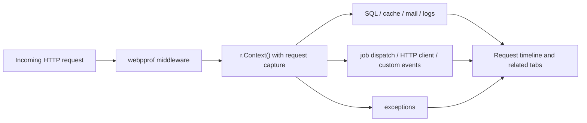

# Execution correlation and automatic findings

webpprof builds related tabs and request timelines from the request capture
carried by `context.Context`.



## Propagate the handler context

Pass the handler context through every related operation:

```go
func createPlayer(w http.ResponseWriter, r *http.Request) {
    ctx := r.Context()

    if err := db.NewSelect().Model(&player).Where("id = ?", 42).Scan(ctx); err != nil {
        recordException(ctx, err)
        http.Error(w, "database error", http.StatusInternalServerError)
        return
    }
    logger.InfoContext(ctx, "player loaded", "player_id", player.ID)
    _ = mailClient.DialAndSendWithContext(ctx, welcomeMessage)

    request, _ := http.NewRequestWithContext(ctx, http.MethodGet, avatarURL, nil)
    _, _ = client.Do(request)

    // go-cache exposes context-free operations through a context-bound view.
    requestCache := cache.WithContext(ctx)
    _ = requestCache.Put("player:42", player, time.Minute)

    // go-queue dispatch carries correlation through JobContext or ChainContext.
    task := webpprofgoqueue.JobContext(ctx, queue, sendWelcomeEmailJob, nil)
    if err := task.OnQueue("mail").Dispatch(); err != nil {
        recordException(ctx, err)
    }

    webpprof.LogEventContext(ctx, webpprof.Event{
        Kind:    "player",
        Name:    "created",
        Summary: "Player 42 was created",
    })
}

func recordException(ctx context.Context, err error) {
    webpprof.LogExceptionContext(ctx, webpprof.Exception{
        Type:    fmt.Sprintf("%T", err),
        Message: err.Error(),
        Stack:   string(debug.Stack()),
    })
}
```

HTTP and Gin middleware record recovered panics as related exceptions with a
stack trace, then propagate the panic as before.

## Standalone Schedule, Callable, and Task executions

Each profiled Schedule invocation is its own execution root. The wrapper passes
a context whose parent entry is the Schedule ID into the task, so every
context-aware query, log, cache operation, outgoing HTTP call, exception, or
custom event becomes part of that Schedule's execution tree.

```go
refresh := webpprofschedule.ProfileWith(profiler, "players.refresh", func(ctx context.Context) {
    players, err := repository.List(ctx)
    if err != nil {
        logger.ErrorContext(ctx, "scheduled refresh failed", "error", err)
        return
    }
    logger.InfoContext(ctx, "scheduled refresh completed", "count", len(players))
})

refresh(context.Background())
```

Open the Schedule entry in the UI to inspect its Findings, Queries, Logs, HTTP
Client, Cache, Events, and Timeline tabs. The events API exposes the same
hierarchy as `?scope_id=<schedule-id>`, while the analyzer is available at
`/api/schedules/<schedule-id>/analysis`.

Use Callable for an explicitly invoked custom command whose semantics are
neither an HTTP request nor a cron task:

```go
reindex := webpprofcallable.ProfileWith(profiler, "players.reindex", func(ctx context.Context) error {
    if err := repository.Reindex(ctx); err != nil {
        return err
    }
    logger.InfoContext(ctx, "player index rebuilt")
    return nil
})
```

Callable is also a standalone root, even when invoked by an HTTP handler. Its
analysis is available through `AnalyzeCallable` and
`/api/callables/<callable-id>/analysis`.

Use Task to measure a long-running application operation that is not naturally
a request, cron invocation, or command:

```go
measurement := profiler.MeasureTask(ctx, webpprof.Task{
    Name:   "reports.players.generate",
    Fields: map[string]any{"format": "pdf"},
}, func(taskCtx context.Context) error {
    return reports.Generate(taskCtx)
})
```

Task is a standalone root as well. Pass `taskCtx` to SQL, logging, cache, and
HTTP integrations; inspect the result through `AnalyzeTask`,
`/api/tasks/<task-id>/analysis`, or `?scope_id=<task-id>`. Use `StartTask` with
`Finish` or `FinishResult` when the measured lifecycle crosses function
boundaries.

| Integration or API | How to preserve correlation |
| --- | --- |
| Bun, `database/sql`, go-redis, mail, `slog`, outgoing HTTP | Pass `r.Context()` to the normal operation. |
| go-cache | Call `cache.WithContext(r.Context())` first. |
| go-queue dispatch | Build the task with `JobContext` or `ChainContext`. |
| Manual events | Use the corresponding `Log*Context` helper. |
| Background work | Use a non-context API and optionally set `OriginRequestID`. |

## Tags and the tag watcher

Use `WithTags` near the start of a request. Tags are attached to the request and
inherited by every context-aware event. Entity-specific `Meta.Tags` replace
inherited values with the same key.

```go
func tagRequest(next http.Handler) http.Handler {
    return http.HandlerFunc(func(w http.ResponseWriter, r *http.Request) {
        ctx := webpprof.WithTags(r.Context(), map[string]string{
            "tenant":      tenantFromRequest(r),
            "environment": "development",
        })
        next.ServeHTTP(w, r.WithContext(ctx))
    })
}

// Request capture must wrap the tagging middleware.
handler := webpprofhttp.MiddlewareWith(profiler, tagRequest(applicationHandler))
```

The header tag watcher searches keys and values and renders at most five
matches. With an empty search it shows the five most frequently recorded tags.
Selected tags filter navigation counts, tables, request relations, dashboard
event metrics, and live WebSocket updates. Multiple selections use `AND`
semantics and are stored as repeated `tag` parameters in the URL.

The events API uses the same predicate:

```text
GET /debug/webpprof/api/events?tag=tenant%3Dacme&tag=environment%3Ddevelopment
```

`tag=tenant` matches any entity with the key. `tag=tenant%3Dacme` also requires
the exact value. Tags are searchable metadata: never put secrets in them, keep
keys non-empty, and do not use `=` inside a key.

## Middleware timing

Go cannot discover names from an already composed middleware chain. Wrap each
middleware you want to measure. The request profiler must remain outermost so
middleware entries inherit the request ID.

```go
profiled := webpprofhttp.ProfileMiddlewareWith(profiler, "authentication", authentication)(
    webpprofhttp.ProfileMiddlewareWith(profiler, "rate-limit", rateLimit)(
        applicationHandler,
    ),
)
handler := webpprofhttp.MiddlewareWith(profiler, profiled)
```

For Gin, register request capture before named middleware:

```go
router.Use(webpprofgin.MiddlewareWith(profiler))
router.Use(webpprofgin.ProfileMiddlewareWith(profiler, "authentication", authentication))
```

The middleware `Duration` remains the complete invocation span so its children
can be positioned and correlated correctly. The standard HTTP profiler also
records `WorkDuration` and `WorkSpans`: time spent before, between, and after
calls to `next`, excluding the time delegated to `next`. A query, cache access,
or outgoing HTTP call made by the middleware remains nested beneath it and is
included in its work duration. The UI renders the complete span as a subdued
envelope and the middleware work as solid segments.

Gin's `HandlerFunc` API does not expose the boundary of `c.Next()` to wrappers,
so Gin middleware retains the complete-span duration unless work timing is
provided manually. Named Gin middleware still propagates its entry ID while it
runs, so Bun queries and other context-aware operations are nested under the
correct middleware. Panicking middleware is recorded with state `panicked`,
then the panic is propagated.

## Automatic findings

The Go analyzer derives findings from the complete Request, Schedule, Callable, or Task
execution timeline. Current rules detect:

- a read-query fingerprint repeated at least three times from the same parent
  operation or callsite, connection, and database as a possible N+1;
- SQL covering at least 50% of effective execution wall-clock time, counting
  overlapping queries once;
- at least three successful, non-overlapping `GET`, `HEAD`, or `OPTIONS` calls
  to one HTTP host;
- a cache read miss followed within 100 ms by at least three identical queries;
- named middleware with measured work duration of at least 100 ms. When work
  timing is unavailable, the analyzer falls back to the complete invocation
  span but suppresses that fallback finding if a nested operation explains at
  least half of it;
- measured custom events lasting at least 500 ms and a child operation that
  accounts for at least half of an execution. Bottleneck selection follows
  `ParentID` descendants: when a child explains at least half of an inclusive
  parent span, the deeper operation is reported instead of its wrapper;
- conservative normalized concerns from a stored plain EXPLAIN plan, including
  full scans, temporary sorts, and large row estimates. Full scans and sorts
  are surfaced only for queries that are already slow.

It also reports direct slow requests, schedules, callables, or tasks, queries, and HTTP
calls; failed requests, queries, cache operations, events, middleware,
exceptions, execution roots, jobs, mail, and HTTP calls; and a high cache miss
rate when no richer pattern applies. Miss rate considers only successful reads
and requires at least five samples. Writes and cache errors are excluded.

A `Bottleneck` label requires both at least 50% of the execution window and an
absolute latency threshold for the operation type. The defaults are 50 ms for
SQL and cache access, 100 ms for middleware, and 500 ms for outbound HTTP,
custom events, jobs, and email. SQL bottleneck detection is independent from
the slow-query finding: queries become slow-query warnings at 100 ms and danger
findings at 500 ms. The UI and Go analyzer use the same bottleneck thresholds,
so the label is omitted when an operation is merely the longest among otherwise
fast work.

Work related only through `OriginRequestID` remains visible but is not charged
to the originating HTTP request's latency or findings.

Each finding contains a stable code, severity, evidence, suggested action, and
supporting entry IDs. Applications can call the analyzer without the UI:

```go
analysis, ok := profiler.AnalyzeRequest(requestID)
if ok {
    for _, finding := range analysis.Findings {
        log.Printf("%s: %s", finding.Code, finding.Title)
    }
}

if scheduleAnalysis, ok := profiler.AnalyzeSchedule(scheduleID); ok {
    log.Printf("schedule findings: %d", len(scheduleAnalysis.Findings))
}

if callableAnalysis, ok := profiler.AnalyzeCallable(callableID); ok {
    log.Printf("callable findings: %d", len(callableAnalysis.Findings))
}

if taskAnalysis, ok := profiler.AnalyzeTask(taskID); ok {
    log.Printf("task findings: %d", len(taskAnalysis.Findings))
}
```

The authenticated HTTP endpoints are:

```text
GET /debug/webpprof/api/requests/{request-id}/analysis
GET /debug/webpprof/api/schedules/{schedule-id}/analysis
GET /debug/webpprof/api/callables/{callable-id}/analysis
GET /debug/webpprof/api/tasks/{task-id}/analysis
```

## Custom request adapters

Use `BeginRequest`, put its capture in the operation context with
`WithRequest`, and finish it exactly once:

```go
capture := profiler.BeginRequest(webpprof.Request{
    Method: "RPC",
    Path:   "/players.Create",
})
ctx = webpprof.WithRequest(ctx, capture)

webpprof.LogCacheContext(ctx, webpprof.Cache{
    Store:     "redis",
    Operation: "get",
    Key:       "player:42",
    Hit:       true,
})

capture.Finish(webpprof.RequestResult{Status: http.StatusOK})
```

See [Event reference](event-reference.md) for manual entity contracts.
