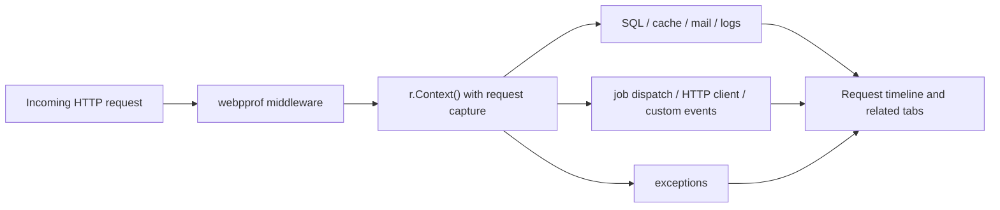

# Request correlation and automatic findings

webpprof builds related tabs and request timelines from the request capture
carried by `context.Context`.



## Propagate the handler context

Pass the handler context through every related operation:

```go
func createPlayer(w http.ResponseWriter, r *http.Request) {
    ctx := r.Context()

    if err := db.NewSelect().Model(&player).Where("id = ?", 42).Scan(ctx); err != nil {
        recordException(ctx, err)
        http.Error(w, "database error", http.StatusInternalServerError)
        return
    }
    logger.InfoContext(ctx, "player loaded", "player_id", player.ID)
    _ = mailClient.DialAndSendWithContext(ctx, welcomeMessage)

    request, _ := http.NewRequestWithContext(ctx, http.MethodGet, avatarURL, nil)
    _, _ = client.Do(request)

    // go-cache exposes context-free operations through a context-bound view.
    requestCache := cache.WithContext(ctx)
    _ = requestCache.Put("player:42", player, time.Minute)

    // go-queue dispatch carries correlation through JobContext or ChainContext.
    task := webpprofgoqueue.JobContext(ctx, queue, sendWelcomeEmailJob, nil)
    if err := task.OnQueue("mail").Dispatch(); err != nil {
        recordException(ctx, err)
    }

    webpprof.LogEventContext(ctx, webpprof.Event{
        Kind:    "player",
        Name:    "created",
        Summary: "Player 42 was created",
    })
}

func recordException(ctx context.Context, err error) {
    webpprof.LogExceptionContext(ctx, webpprof.Exception{
        Type:    fmt.Sprintf("%T", err),
        Message: err.Error(),
        Stack:   string(debug.Stack()),
    })
}
```

HTTP and Gin middleware record recovered panics as related exceptions with a
stack trace, then propagate the panic as before.

| Integration or API | How to preserve correlation |
| --- | --- |
| Bun, `database/sql`, go-redis, mail, `slog`, outgoing HTTP | Pass `r.Context()` to the normal operation. |
| go-cache | Call `cache.WithContext(r.Context())` first. |
| go-queue dispatch | Build the task with `JobContext` or `ChainContext`. |
| Manual events | Use the corresponding `Log*Context` helper. |
| Background work | Use a non-context API and optionally set `OriginRequestID`. |

## Tags and the tag watcher

Use `WithTags` near the start of a request. Tags are attached to the request and
inherited by every context-aware event. Entity-specific `Meta.Tags` replace
inherited values with the same key.

```go
func tagRequest(next http.Handler) http.Handler {
    return http.HandlerFunc(func(w http.ResponseWriter, r *http.Request) {
        ctx := webpprof.WithTags(r.Context(), map[string]string{
            "tenant":      tenantFromRequest(r),
            "environment": "development",
        })
        next.ServeHTTP(w, r.WithContext(ctx))
    })
}

// Request capture must wrap the tagging middleware.
handler := webpprofhttp.MiddlewareWith(profiler, tagRequest(applicationHandler))
```

The header tag watcher searches keys and values and renders at most five
matches. With an empty search it shows the five most frequently recorded tags.
Selected tags filter navigation counts, tables, request relations, dashboard
event metrics, and live WebSocket updates. Multiple selections use `AND`
semantics and are stored as repeated `tag` parameters in the URL.

The events API uses the same predicate:

```text
GET /debug/webpprof/api/events?tag=tenant%3Dacme&tag=environment%3Ddevelopment
```

`tag=tenant` matches any entity with the key. `tag=tenant%3Dacme` also requires
the exact value. Tags are searchable metadata: never put secrets in them, keep
keys non-empty, and do not use `=` inside a key.

## Middleware timing

Go cannot discover names from an already composed middleware chain. Wrap each
middleware you want to measure. The request profiler must remain outermost so
middleware entries inherit the request ID.

```go
profiled := webpprofhttp.ProfileMiddlewareWith(profiler, "authentication", authentication)(
    webpprofhttp.ProfileMiddlewareWith(profiler, "rate-limit", rateLimit)(
        applicationHandler,
    ),
)
handler := webpprofhttp.MiddlewareWith(profiler, profiled)
```

For Gin, register request capture before named middleware:

```go
router.Use(webpprofgin.MiddlewareWith(profiler))
router.Use(webpprofgin.ProfileMiddlewareWith(profiler, "authentication", authentication))
```

Middleware duration is inclusive: it contains the named middleware and all
downstream handlers it invokes. Panicking middleware is recorded with state
`panicked`, then the panic is propagated.

## Automatic findings

The Go analyzer derives findings from the complete request timeline. Current
rules detect:

- a query fingerprint repeated at least three times as a possible N+1;
- SQL covering at least 50% of effective request wall-clock time, counting
  overlapping queries once;
- at least three successful, non-overlapping `GET`, `HEAD`, or `OPTIONS` calls
  to one HTTP host;
- a cache read miss followed within 100 ms by at least three identical queries;
- named middleware with inclusive duration of at least 100 ms.

It also reports direct slow requests, queries, and HTTP calls; failed jobs,
mail, and HTTP calls; and a high cache miss rate when no richer pattern applies.
Miss rate considers only successful reads and requires at least five samples.
Writes and cache errors are excluded.

Work related only through `OriginRequestID` remains visible but is not charged
to the originating HTTP request's latency or findings.

Each finding contains a stable code, severity, evidence, suggested action, and
supporting entry IDs. Applications can call the analyzer without the UI:

```go
analysis, ok := profiler.AnalyzeRequest(requestID)
if ok {
    for _, finding := range analysis.Findings {
        log.Printf("%s: %s", finding.Code, finding.Title)
    }
}
```

The authenticated HTTP endpoint is:

```text
GET /debug/webpprof/api/requests/{request-id}/analysis
```

## Custom request adapters

Use `BeginRequest`, put its capture in the operation context with
`WithRequest`, and finish it exactly once:

```go
capture := profiler.BeginRequest(webpprof.Request{
    Method: "RPC",
    Path:   "/players.Create",
})
ctx = webpprof.WithRequest(ctx, capture)

webpprof.LogCacheContext(ctx, webpprof.Cache{
    Store:     "redis",
    Operation: "get",
    Key:       "player:42",
    Hit:       true,
})

capture.Finish(webpprof.RequestResult{Status: http.StatusOK})
```

See [Event reference](event-reference.md) for manual entity contracts.
